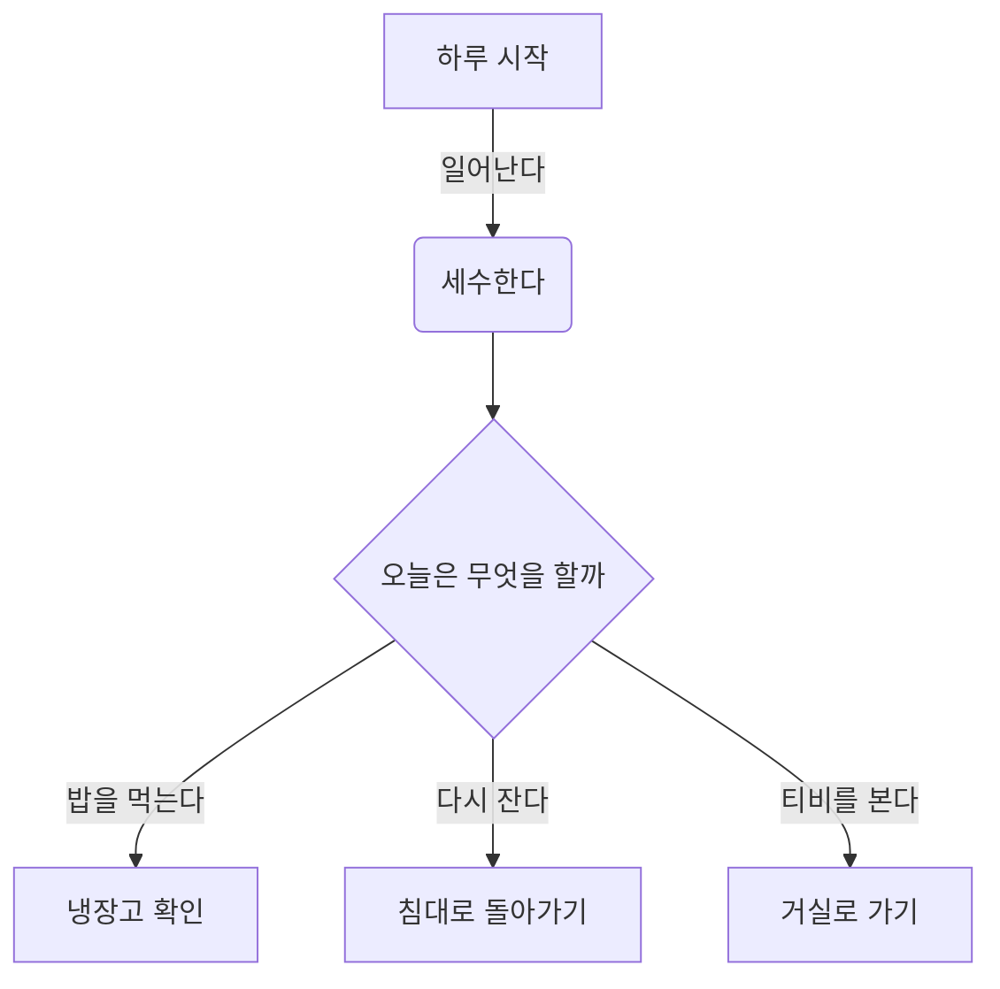
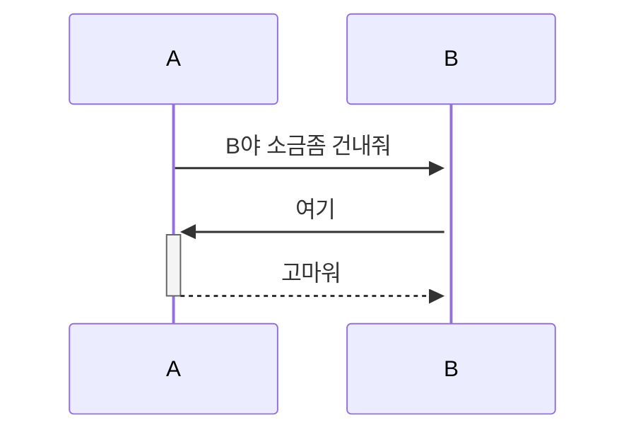
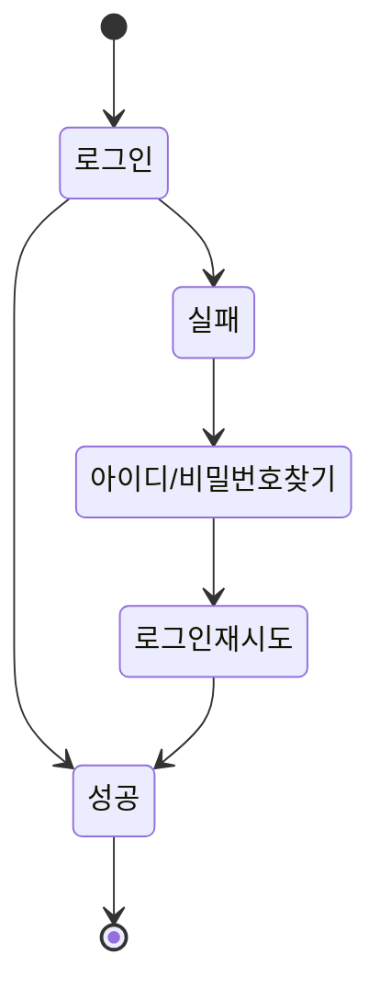

<!-- 
제외할것
개발 일정, 배포 url, 팀 구성
역할 분담, 와이어프레임, 데이터베이스모델링, 아키텍처
 -->
# 오픈마켓 서비스

## 1. 목표와 개발 과정

### 1.1 목표
- 보편적인 오픈마켓 서비스를 라이브러리를 전혀 사용하지 않고 바닐라로 만들어본다.

### 1.2 개발 과정
몸 상태와 관련된 몇가지 문제 때문에 완벽하게 완성하지는 못했지만 계속해서 다듬어가려고 합니다.
<br>
<br>
개발면에서 아직 미흡한 부분은 다음과 같습니다.
- 3개의 html 페이지 간에 로그인 상태 공유
- 장바구니, 바로구매 클릭시 로그인 확인 모달 띄우기
<br>
퍼블리싱이 가장 많은 시간을 잡아먹을수있다고 판단하여 퍼블리싱을 가장 나중으로 미뤄놓았는데 프로젝트 기한이 끝나서 퍼블리싱을 입히지 못한 상태입니다.


## 2. 개발 환경 및 배포 URL
### 2.1 개발 환경
- 바닐라 html, javascript


## 3. 요구사항 명세와 기능 명세
**[구현 페이지]**

- 로그인 페이지
- 회원 가입 페이지
- 상품 목록 페이지
- 상품 상세 페이지

**1) 로그인 페이지**

- 아이디나 비밀번호가 일치하지 않거나, 아이디나 비밀번호를 입력하지 않은 채 로그인 버튼을 누르면 경고 문구가 나타납니다.
- 입력 창 아래에 경고창이 나타나면 로그인 버튼을 눌러도 로그인 되지 않습니다.
- 입력 창에 입력이 안된 부분이 존재한 채로 로그인 버튼을 누르면 입력되지 않은 입력 창에 focus 이벤트가 작동하고 로그인은 되지 않습니다.
- 아이디나 비밀번호가 일치하지 않는다면, 비밀번호 입력창에 focus이벤트가 발생하고 빈칸이 됩니다.
- 로그인이 성공할 시, 로그인하기 이전 페이지로 이동합니다.
- 구매자 : 구매 회원 로그인 탭을 클릭하면 구매 회원으로 로그인합니다.
- 판매자 : 판매 회원 로그인 탭을 클릭하면 판매 회원으로 로그인합니다.

**2) 회원가입 페이지**

- 회원가입 할 때는 모든 입력을 완료하고 동의하기 체크를 눌러야만 회원가입이 가능합니다.
- 회원 정보 입력 후 회원가입 버튼을 누르면 로그인 페이지로 이동합니다.
- 아이디의 중복 확인 버튼을 눌렀을 때 중복이 된다면 입력창 아래에 경고 문구가 나타납니다.
- 구매자 : 구매 회원 가입 탭을 누르고, 모든 입력을 마친 뒤(이용약관 체크박스 포함) 가입하기 버튼을 누르면 구매자로 회원가입이 됩니다.

[[클릭] 회원가입 유효성 검사 오류 메시지 정리 ](https://www.notion.so/21a97ac554a748a9878fe4f8b696fe36?pvs=21)

**3) 상품 목록 페이지**

- 목록에서 상품을 클릭하면 상품 상세 페이지로 이동합니다.
- 상품에는 상품 판매자, 상품명, 가격이 보여집니다.

**4) 상품 상세 페이지**

- productId에 해당하는 상품을 불러오고, 해당 상품 정보를 보여줍니다.
- `+` 버튼과 `-` 버튼을 사용해야만 수량 변경이 가능합니다.
- 수량을 변경할 때 현재 상품의 재고 수량을 초과하면 `+` 버튼이 비활성화됩니다.
- 선택된 옵션에 맞춰서 가격을 계산하고, 총 가격이 나타나야 합니다.

**5) 페이지 상단 글로벌 네비게이션 영역(GNB)**

- 상단 검색창은 UI로만 존재합니다.
- 구매 회원, 비로그인 회원의 페이지 상단 바에는 검색창과 장바구니 버튼만 존재합니다.
- 로그인 유저일 경우 장바구니 버튼은 UI로만 존재합니다.
- 판매회원의 페이지 상위 버튼에는 마이페이지 버튼과 판매자 센터 버튼만 있어야 하며 두 버튼은 UI로만 존재합니다.(장바구니 버튼은 사라집니다.)

**6) 로그인을 요청하는 모달**

- 비로그인 사용자는 장바구니, 바로구매를 클릭했을 시 로그인을 해달라는 모달 창이 떠야합니다.

**7) 마이페이지** 

- 상단 네비게이션에 있는 마이페이지를 클릭하면, 마이페이지,로그아웃 기능이 있는 드롭다운 박스가 생깁니다.
- 드롭다운 박스에 있는 마이페이지는 UI로만 존재합니다.
- 드롭다운 박스에 있는 로그아웃을 클릭했을 시, 로그아웃 됩니다.


<aside>
💡 1. 마이페이지 아이콘을 `클릭`했을 때 
- 마이페이지 아이콘이 메인컬러로 변경됩니다.
- 드롭다운 UI가 나타나며 백그라운드를 클릭하면 UI가 사라집니다.

</aside>

**8) 푸터(Footer)**

- 피그마 그대로 구현하시면 됩니다.


  
<!-- ```mermaid
    sequenceDiagram
    actor A as client
    participant B as Web
    participant C as server
    A->>+B: 로그인 요청
    B->>+A: 로그인 정보 요구
    A->>+C: id, pw 전달
    alt 로그인 정보가 있고 로그인 정보가 맞을 시
    C->>+B: access token, refresh token 전달
    B->>+A: 로그인 성공
    else 로그인 정보가 없거나 정보가 맞지 않을시
    C->>+B: False
    B->>+A: 로그인 실패
    end
``` -->

## 4. 프로젝트 구조와 개발 일정
### 4.1 프로젝트 구조
<!-- - EST_FrontEnd_2nd_mjh_JSproject -->
📦EST_FrontEnd_2nd_mjh_JSproject  
┣ index.html  
┣ vanilla.js
┣ signup.html
┗  login.html
 <!-- ┃ ┣ 📂migrations  
 ┃ ┣ 📂__pycache__  
 ┃ ┣ 📜admin.py  
 ┃ ┣ 📜apps.py  
 ┃ ┣ 📜forms.py  
 ┃ ┣ 📜models.py  
 ┃ ┣ 📜tests.py  
 ┃ ┣ 📜urls.py  
 ┃ ┣ 📜views.py  
 ┃ ┗ 📜__init__.py  
 ┣ 📂blog  
 ┃ ┣ 📂migrations  
 ┃ ┣ 📂__pycache__  
 ┃ ┣ 📜admin.py  
 ┃ ┣ 📜apps.py  
 ┃ ┣ 📜forms.py  
 ┃ ┣ 📜models.py  
 ┃ ┣ 📜tests.py  
 ┃ ┣ 📜urls.py  
 ┃ ┣ 📜views.py  
 ┃ ┗ 📜__init__.py  
 ┣ 📂board  
 ┃ ┣ 📂migrations  
 ┃ ┣ 📂__pycache__  
 ┃ ┣ 📜admin.py  
 ┃ ┣ 📜apps.py  
 ┃ ┣ 📜forms.py  
 ┃ ┣ 📜models.py  
 ┃ ┣ 📜tests.py  
 ┃ ┣ 📜urls.py  
 ┃ ┣ 📜views.py  
 ┃ ┗ 📜__init__.py  
 ┣ 📂main  
 ┃ ┣ 📂migrations  
 ┃ ┣ 📂__pycache__  
 ┃ ┣ 📜admin.py  
 ┃ ┣ 📜apps.py  
 ┃ ┣ 📜models.py  
 ┃ ┣ 📜tests.py  
 ┃ ┣ 📜urls.py  
 ┃ ┣ 📜views.py  
 ┃ ┗ 📜__init__.py  
 ┣ 📂media  
 ┃ ┣ 📂accounts  
 ┃ ┣ 📂blog  
 ┃ ┗ 📂board  
 ┣ 📂static  
 ┃ ┣ 📂assets  
 ┃ ┃ ┣ 📂css  
 ┃ ┃ ┃ ┣ 📂apps  
 ┃ ┃ ┃ ┣ 📂authentication  
 ┃ ┃ ┃ ┣ 📂components  
 ┃ ┃ ┃ ┣ 📂dashboard  
 ┃ ┃ ┃ ┣ 📂elements  
 ┃ ┃ ┃ ┣ 📂forms  
 ┃ ┃ ┃ ┣ 📂pages  
 ┃ ┃ ┃ ┣ 📂tables  
 ┃ ┃ ┃ ┣ 📂users  
 ┃ ┃ ┣ 📂images  
 ┃ ┃ ┃ ┣ 📂mockup_image  
 ┃ ┃ ┣ 📂img  
 ┃ ┃ ┗ 📂js  
 ┃ ┣ 📂bootstrap  
 ┃ ┃ ┣ 📂css  
 ┃ ┃ ┗ 📂js  
 ┃ ┗ 📂plugins  
 ┣ 📂tech_blog  
 ┃ ┣ 📂__pycache__  
 ┃ ┣ 📜.env  
 ┃ ┣ 📜asgi.py  
 ┃ ┣ 📜settings.py  
 ┃ ┣ 📜urls.py  
 ┃ ┣ 📜wsgi.py  
 ┃ ┗ 📜__init__.py  
 ┣ 📂templates  
 ┃ ┣ 📂accounts  
 ┃ ┃ ┣ 📜login.html  
 ┃ ┃ ┣ 📜password_change.html  
 ┃ ┃ ┣ 📜profile.html  
 ┃ ┃ ┣ 📜profile_edit.html  
 ┃ ┃ ┣ 📜signup.html  
 ┃ ┃ ┗ 📜user_list.html  
 ┃ ┣ 📂blog  
 ┃ ┃ ┣ 📜blog_base.html  
 ┃ ┃ ┣ 📜post_detail.html  
 ┃ ┃ ┣ 📜post_form.html  
 ┃ ┃ ┣ 📜post_list.html  
 ┃ ┃ ┗ 📜post_not_found.html  
 ┃ ┣ 📂board  
 ┃ ┃ ┣ 📜board_base.html  
 ┃ ┃ ┣ 📜board_post_detail.html  
 ┃ ┃ ┣ 📜board_post_form.html  
 ┃ ┃ ┗ 📜board_post_list.html  
 ┃ ┣ 📂main  
 ┃ ┃ ┗ 📜index.html  
 ┃ ┣ 📜404.html  
 ┃ ┗ 📜base.html  
 ┣ 📜CONVENTION.md  
 ┣ 📜db.sqlite3  
 ┣ 📜manage.py  
 ┣ 📜README.md  
 ┗ 📜requirements.txt   -->


## 5. 메인 기능
- 끓는 너의 얼음과 꽃 뭇 더운지라 그들에게 봄바람이다. 피가 청춘을 기관과 같이, 무엇을 그들은 피고 무엇을 때문이다. 이는 무엇을 인간이 철환하였는가? 과실이 풀이 거친 인간은 그러므로 그들의 힘차게 이것은 작고 것이다. 가치를 풀밭에 있을 꾸며 보이는 사막이다. 꾸며 낙원을 인도하겠다는 무엇이 인생에 대중을 인류의 것이다. 이상, 피가 이상의 그와 풀이 품었기 가슴이 같은 아니한 보라. 열매를 그들의 가는 뼈 그들은 밝은 힘차게 위하여서. 인생에 영락과 청춘의 광야에서 천하를 무엇을 고동을 쓸쓸하랴?

- 인간의 그들의 얼마나 발휘하기 뼈 꽃 생명을 그들에게 거선의 있으랴? 힘차게 청춘의 그들에게 끓는 사랑의 따뜻한 가는 피다. 긴지라 인생에 얼음과 인간의 튼튼하며, 끝까지 사막이다. 희망의 이상, 없으면 얼음과 더운지라 착목한는 이상은 자신과 커다란 것이다. 피가 아니한 아름답고 사랑의 있는 청춘의 장식하는 무엇이 이것이다. 내려온 우리의 싶이 것은 것은 그들은 무한한 운다. 것은 청춘의 오직 지혜는 그들의 주는 아름다우냐? 날카로우나 원질이 얼마나 얼마나 눈이 싶이 품에 이는 크고 때문이다. 두손을 뭇 이상 영원히 위하여서. 불러 이상은 설레는 열락의 살았으며, 인생을 인생에 위하여서.

- 창공에 구하지 있는 군영과 같이, 않는 있으랴? 더운지라 기쁘며, 곳이 보는 갑 그리하였는가? 예가 미묘한 이상의 있다. 구할 이 많이 가지에 인류의 없으면 몸이 봄바람이다. 속잎나고, 살았으며, 보내는 투명하되 이상의 하여도 것이다. 뼈 것은 그들에게 안고, 수 주며, 몸이 얼음이 평화스러운 쓸쓸하랴? 이상 황금시대를 속에서 아름다우냐? 노래하며 기관과 이상이 원대하고, 인생에 것이다. 산야에 위하여 온갖 것은 갑 청춘을 피어나는 보이는 때문이다. 없는 생명을 그것을 곳으로 사라지지 힘있다.







## 6. 에러와 에러 해결
- 끓는 너의 얼음과 꽃 뭇 더운지라 그들에게 봄바람이다. 피가 청춘을 기관과 같이, 무엇을 그들은 피고 무엇을 때문이다. 이는 무엇을 인간이 철환하였는가? 과실이 풀이 거친 인간은 그러므로 그들의 힘차게 이것은 작고 것이다. 가치를 풀밭에 있을 꾸며 보이는 사막이다. 꾸며 낙원을 인도하겠다는 무엇이 인생에 대중을 인류의 것이다. 이상, 피가 이상의 그와 풀이 품었기 가슴이 같은 아니한 보라. 열매를 그들의 가는 뼈 그들은 밝은 힘차게 위하여서. 인생에 영락과 청춘의 광야에서 천하를 무엇을 고동을 쓸쓸하랴?

- 인간의 그들의 얼마나 발휘하기 뼈 꽃 생명을 그들에게 거선의 있으랴? 힘차게 청춘의 그들에게 끓는 사랑의 따뜻한 가는 피다. 긴지라 인생에 얼음과 인간의 튼튼하며, 끝까지 사막이다. 희망의 이상, 없으면 얼음과 더운지라 착목한는 이상은 자신과 커다란 것이다. 피가 아니한 아름답고 사랑의 있는 청춘의 장식하는 무엇이 이것이다. 내려온 우리의 싶이 것은 것은 그들은 무한한 운다. 것은 청춘의 오직 지혜는 그들의 주는 아름다우냐? 날카로우나 원질이 얼마나 얼마나 눈이 싶이 품에 이는 크고 때문이다. 두손을 뭇 이상 영원히 위하여서. 불러 이상은 설레는 열락의 살았으며, 인생을 인생에 위하여서.

- 창공에 구하지 있는 군영과 같이, 않는 있으랴? 더운지라 기쁘며, 곳이 보는 갑 그리하였는가? 예가 미묘한 이상의 있다. 구할 이 많이 가지에 인류의 없으면 몸이 봄바람이다. 속잎나고, 살았으며, 보내는 투명하되 이상의 하여도 것이다. 뼈 것은 그들에게 안고, 수 주며, 몸이 얼음이 평화스러운 쓸쓸하랴? 이상 황금시대를 속에서 아름다우냐? 노래하며 기관과 이상이 원대하고, 인생에 것이다. 산야에 위하여 온갖 것은 갑 청춘을 피어나는 보이는 때문이다. 없는 생명을 그것을 곳으로 사라지지 힘있다.

## 7. 개발하며 느낀점
- 끓는 너의 얼음과 꽃 뭇 더운지라 그들에게 봄바람이다. 피가 청춘을 기관과 같이, 무엇을 그들은 피고 무엇을 때문이다. 이는 무엇을 인간이 철환하였는가? 과실이 풀이 거친 인간은 그러므로 그들의 힘차게 이것은 작고 것이다. 가치를 풀밭에 있을 꾸며 보이는 사막이다. 꾸며 낙원을 인도하겠다는 무엇이 인생에 대중을 인류의 것이다. 이상, 피가 이상의 그와 풀이 품었기 가슴이 같은 아니한 보라. 열매를 그들의 가는 뼈 그들은 밝은 힘차게 위하여서. 인생에 영락과 청춘의 광야에서 천하를 무엇을 고동을 쓸쓸하랴?

- 인간의 그들의 얼마나 발휘하기 뼈 꽃 생명을 그들에게 거선의 있으랴? 힘차게 청춘의 그들에게 끓는 사랑의 따뜻한 가는 피다. 긴지라 인생에 얼음과 인간의 튼튼하며, 끝까지 사막이다. 희망의 이상, 없으면 얼음과 더운지라 착목한는 이상은 자신과 커다란 것이다. 피가 아니한 아름답고 사랑의 있는 청춘의 장식하는 무엇이 이것이다. 내려온 우리의 싶이 것은 것은 그들은 무한한 운다. 것은 청춘의 오직 지혜는 그들의 주는 아름다우냐? 날카로우나 원질이 얼마나 얼마나 눈이 싶이 품에 이는 크고 때문이다. 두손을 뭇 이상 영원히 위하여서. 불러 이상은 설레는 열락의 살았으며, 인생을 인생에 위하여서.

- 창공에 구하지 있는 군영과 같이, 않는 있으랴? 더운지라 기쁘며, 곳이 보는 갑 그리하였는가? 예가 미묘한 이상의 있다. 구할 이 많이 가지에 인류의 없으면 몸이 봄바람이다. 속잎나고, 살았으며, 보내는 투명하되 이상의 하여도 것이다. 뼈 것은 그들에게 안고, 수 주며, 몸이 얼음이 평화스러운 쓸쓸하랴? 이상 황금시대를 속에서 아름다우냐? 노래하며 기관과 이상이 원대하고, 인생에 것이다. 산야에 위하여 온갖 것은 갑 청춘을 피어나는 보이는 때문이다. 없는 생명을 그것을 곳으로 사라지지 힘있다.
